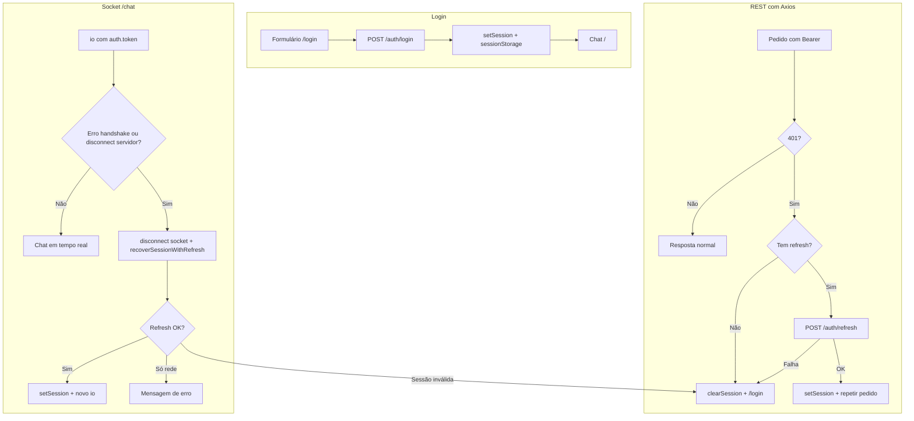

# Autenticação e refresh de tokens no chat-app

Este guia explica, de forma didática, **como o utilizador fica autenticado**, **como os tokens são guardados e renovados** e **que ficheiros fazem o quê**. Está alinhado com a API descrita em `CHAT-APP-AUTH-INTEGRATION.md`.

---

## 1. Ideia geral (o que estamos a resolver)

A API usa **JWT** em dois momentos:

1. **REST** — cada pedido autenticado leva o cabeçalho `Authorization: Bearer <accessToken>`.
2. **WebSocket (Socket.IO, namespace `/chat`)** — no handshake, o cliente envia o mesmo JWT em `auth: { token: "<accessToken>" }`.

O **access token** tem vida curta (ex.: 15 minutos). O **refresh token** tem vida longa (ex.: 7 dias) e serve **só** para pedir um **novo par** de tokens sem voltar a pedir palavra-passe.

Analogia simples:

- **Access token** = bilhete de entrada rápido que expira cedo.
- **Refresh token** = comprovativo que permite pedir um bilhete novo na portaria, sem refazer o registo completo.

Quando o access token expira, o servidor pode responder **401** (REST) ou recusar / fechar a ligação do **socket** (JWT inválido). O front-end precisa de **renovar** tokens e **voltar a tentar** — ou, se o refresh já não for válido, **terminar a sessão** e ir ao login.

---

## 2. O que o backend espera (resumo)

| Ação | Método e rota (relativa à base `/api`) | Corpo típico |
|------|----------------------------------------|--------------|
| Login | `POST /auth/login` | `{ "code": string, "password": string }` |
| Renovar | `POST /auth/refresh` | `{ "refreshToken": string }` |
| Logout | `POST /auth/logout` | `{ "refreshToken": string }` — resposta `204` |

Resposta de login/refresh (200): inclui `accessToken`, `refreshToken`, `tokenType`, `accessExpiresIn`, `refreshExpiresIn`. Em cada refresh bem-sucedido a API pode **rodar** o refresh token: o cliente **deve guardar sempre o novo** refresh devolvido.

A variável **`NEXT_PUBLIC_API_URL`** deve apontar para a base da API **com** o prefixo `/api` (ex.: `http://localhost:3001/api`). O cliente Axios usa isso como `baseURL`; as rotas de auth são caminhos como `/auth/login`.

---

## 3. Onde os tokens ficam no browser

| Dado | Onde | Porquê |
|------|------|--------|
| `accessToken` + `refreshToken` (após login) | `sessionStorage`, chave interna `chat-app.auth.v1` | Persiste a sessão **enquanto o separador está aberto**; fecha o separador e a sessão do storage típico desaparece (comportamento escolhido para este projeto). |
| Cópia em memória | **Zustand** (`useAuthStore`) | A UI e o socket reagem a mudanças; o token “atual” é lido de forma consistente. |

Funções dedicadas evitam espalhar strings mágicas pelo código:

- **`src/lib/auth/auth-storage.ts`** — `loadAuthFromSession`, `saveAuthToSession`: leem/gravam o JSON na `sessionStorage`.

O **access token** também é exposto via **`getAuthAccessTokenSync()`** (`auth-access.ts`), que **prioriza** o que está na `sessionStorage` e depois o estado Zustand — útil logo no primeiro render no cliente, antes de tudo estar hidratado.

---

## 4. Mapa dos ficheiros (para que serve cada um)

### Tipos e contratos

| Ficheiro | Função |
|----------|--------|
| `src/types/auth.ts` | Tipos TypeScript alinhados à API: `AuthTokensResponse`, `LoginRequest`, `RefreshRequest`, `LogoutRequestBody`. |

### Chamadas HTTP à API de auth

| Ficheiro | Função |
|----------|--------|
| `src/lib/auth/auth-api.ts` | `loginRequest`, `refreshAccessTokenRequest`, `logoutRequest`. Normaliza respostas (`accessToken` / `refreshToken` em camelCase ou snake_case). Caminhos configuráveis por env (`NEXT_PUBLIC_AUTH_*_PATH`). |
| `src/lib/api/axios-instance.ts` | Instância Axios única com `baseURL` = `getApiBaseUrl()` (`src/lib/api/config.ts`). |
| `src/lib/api/http.ts` | Cliente genérico e **`parseAxiosErrorMessage`**, usado no formulário de login para mostrar erros legíveis. |

### Estado global da sessão

| Ficheiro | Função |
|----------|--------|
| `src/lib/auth/auth-store.ts` | Store **Zustand**: `accessToken`, `refreshToken`, `reconnectNonce`, `setSession`, `clearSession`, `hydrateFromSession`, `bootstrapAccessToken`. **`setSession`** grava na `sessionStorage` **e** incrementa **`reconnectNonce`** — isto é o gatilho para o Socket.IO **voltar a ligar** com um JWT novo. |
| `src/lib/auth/auth-access.ts` | **`getAuthAccessTokenSync()`** — token atual para REST e socket (storage primeiro, depois store). |

### Refresh automático no REST (Axios)

| Ficheiro | Função |
|----------|--------|
| `src/lib/auth/setup-api-auth-interceptors.ts` | **Interceptor de pedido**: anexa `Authorization: Bearer …` se existir token. **Interceptor de resposta**: em **401**, uma vez por pedido, tenta `POST /auth/refresh` com o `refreshToken` do store; em sucesso chama `setSession` e **repete** o pedido original; se falhar, `clearSession` e redireciona para `/login` (via `redirectToLoginIfNeeded`). **Não** aplica este fluxo a `auth/login`, `auth/refresh`, `auth/logout` nem `dev-token`, para evitar ciclos. |
| `src/lib/auth/auth-navigation.ts` | **`redirectToLoginIfNeeded()`** — evita redirecionar se já estivermos em `/login`. |
| `src/lib/auth/recover-session-with-refresh.ts` | **`recoverSessionWithRefresh()`** — mesma lógica de renovação que o interceptor usa, mas **sem depender de um 401 HTTP**: usada quando o **problema aparece no Socket.IO**. Devolve `refreshed`, `no_refresh_token`, `refresh_failed` ou `network_error`. |

### Socket.IO e token do chat

| Ficheiro | Função |
|----------|--------|
| `src/lib/socket/resolve-chat-auth-token.ts` | Descobre qual JWT usar ao abrir o `/chat`: (1) sessão de login (`getAuthAccessTokenSync`), (2) `NEXT_PUBLIC_WS_AUTH_TOKEN`, (3) `POST /api/chat/dev-token` (último recurso em desenvolvimento). |
| `src/contexts/chat-socket-context.tsx` | Cria o cliente `io(...)`, passa `auth: { token }`, gere estado `connecting` / `connected` / `error`. Em **`connect_error`** ou **`disconnect`** compatível com expulsão pelo servidor (ex.: `io server disconnect`, ou mensagem com `jwt`, `unauthor`, etc.), chama **`runAuthRecoveryAfterSocketFailure`**: faz `disconnect()` no socket (para parar reconexões infinitas com JWT velho), corre **`recoverSessionWithRefresh()`** se existir refresh token, ou limpa sessão e manda para o login. Um **`reconnectNonce`** novo (por `setSession`) faz o `useEffect` **recriar** a ligação com o access token atualizado. |

### UI e rotas

| Ficheiro | Função |
|----------|--------|
| `src/app/login/page.tsx` | Formulário: campos “E-mail” e palavra-passe; o valor do primeiro campo é enviado como **`code`** no JSON (compatível com utilizadores tipo `U-ALICE` e com e-mail se a API aceitar). Após sucesso, `setSession` e `router.replace("/")`. |
| `src/components/auth/require-auth.tsx` | Envolve a página principal: se não houver access token após hidratação no cliente, redireciona para `/login`. Usa `useSyncExternalStore` para evitar flashes e problemas de hidratação. |
| `src/app/page.tsx` | Chat por baixo de `RequireAuth`. |
| `src/components/chat/chat-header.tsx` | Botão de logout: `logoutRequest(refreshToken)` (melhor esforço), `clearSession`, `router.replace("/login")`. |
| `src/components/providers/app-providers.tsx` | Arranque da app: instala interceptors e `hydrateFromSession()` no `useEffect`. |

### Variáveis de ambiente

| Ficheiro | Função |
|----------|--------|
| `.env.example` | Lista `NEXT_PUBLIC_API_URL`, opcionais de WebSocket e overrides das rotas de auth. |

---

## 5. Fluxo do login (passo a passo)

1. O utilizador submete o formulário em **`/login`**.
2. Chama-se **`loginRequest({ code, password })`** → `POST /auth/login`.
3. A resposta traz **access** e **refresh** tokens.
4. Chama-se **`useAuthStore.getState().setSession({ accessToken, refreshToken })`**:
   - grava em **`sessionStorage`**;
   - atualiza o **Zustand**;
   - incrementa **`reconnectNonce`** (relevante para o socket).
5. Navegação para **`/`** (chat). O **`RequireAuth`** deixa passar porque já existe access token.

---

## 6. Fluxo de refresh no REST (quando o access expira)

1. Um pedido Axios recebe **401** (token expirado ou inválido para esse endpoint).
2. O **interceptor** verifica se o URL **não** é login/refresh/logout/dev-token.
3. Lê o **`refreshToken`** do store. Se não existir → **`clearSession`** + redirecionamento para **`/login`**.
4. Caso contrário, **`POST /auth/refresh`** com esse refresh.
5. Em sucesso → **`setSession`** com o **novo** access (e o **novo** refresh, se a API o devolver) → o pedido original é **reenviado** com o novo Bearer.
6. Se o refresh falhar (rede ou refresh revogado/expirado) → sessão limpa e redirecionamento para login.

**Nota:** Não existe um temporizador que renova o token *antes* de expirar; a renovação é **reativa**, quando algo falha com 401 ou quando o socket dispara a recuperação (secção seguinte).

---

## 7. Fluxo de refresh no Socket.IO (JWT inválido na ligação)

Problema que isto resolve: o cliente Socket.IO **reconecta sozinho** com o **mesmo** `auth.token`. Se só o access JWT expirou, entras num ciclo de falhas e a UI fica “à espera” para sempre.

O que o código faz:

1. Em **`connect_error`** (handshake falhou) ou em **`disconnect`** após ter estado **ligado**, com motivo associável a expulsão pelo servidor (ex.: **`io server disconnect`** ou texto com **`jwt`**, **`unauthor`**, etc.):
2. Garante que **não** há duas recuperações em paralelo (`socketAuthRecoveryInFlightRef`).
3. Chama **`socket.disconnect()`** para **parar** tentativas de reconexão com o token antigo.
4. Se **não** houver refresh token (ex.: só modo dev-token) → **`clearSession`**, mensagem de erro e **redirecionamento** para login quando aplicável.
5. Se houver refresh → **`recoverSessionWithRefresh()`** (igual conceito ao interceptor: refresh + **`setSession`**).
6. O **`setSession`** incrementa **`reconnectNonce`** → o `useEffect` do provider **volte a executar** → **`resolveChatAuthToken()`** lê o **novo** access → novo **`io(...)`** com JWT válido.

Se a falha for **só de rede** no refresh, a sessão **não** é destruída; mostra-se uma mensagem para o utilizador verificar a ligação.

---

## 8. Logout

1. **`POST /auth/logout`** com o `refreshToken` atual (invalida o refresh no servidor, em melhor esforço).
2. **`clearSession()`** — apaga storage e estado; incrementa de novo o **`reconnectNonce`** para desligar comportamentos que dependem do token.
3. Navegação para **`/login`**.

---

## 9. Diagrama simplificado (visão dos fluxos)

---

## 10. Checklist rápido para quem integra ou depura

- **`NEXT_PUBLIC_API_URL`** correto e CORS no backend com a origem do Next (ex.: `http://localhost:3000`).
- Após login, na `sessionStorage` deve existir o objeto com `accessToken` e `refreshToken`.
- Se o REST renova mas o socket não: confirma que **`setSession`** corre no refresh (incrementa **`reconnectNonce`**).
- Se o socket ficar em loop: confirma que **`disconnect()`** na recuperação está a correr antes do refresh (corta reconexão com JWT velho).
- Utilizadores de seed (ex.: `U-ALICE` / `DevPass#2026`) usam o campo **`code`**, não um campo separado “email” no JSON — o formulário mapeia o primeiro campo para **`code`**.

---

*Documento gerado para o repositório **chat-app**; mantém-se alinhado à integração descrita em `CHAT-APP-AUTH-INTEGRATION.md`.*
