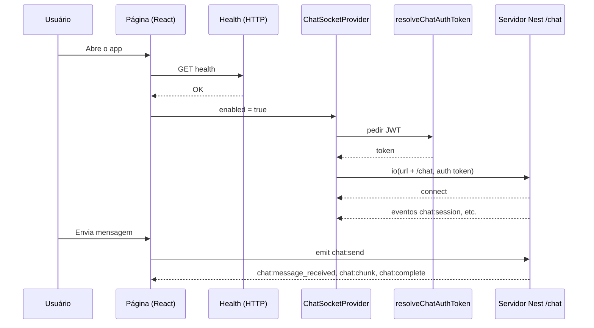

# Fluxo do Socket.IO no chat

> Redigido em **português brasileiro (PT-BR)**.

Este documento descreve **como** o aplicativo se conecta ao servidor Nest pelo Socket.IO, **para que serve** cada parte e **em que ordem** as coisas acontecem. É um guia para quem for ler ou alterar o código.

---

## 1. O que estamos fazendo, em uma frase

O navegador abre uma **conexão em tempo real** (Socket.IO) para o **namespace** `/chat` da sua API Nest, autentica com um **JWT** e troca **eventos nomeados** (`chat:send`, `chat:chunk`, …) em vez de fazer polling HTTP para cada mensagem.

---

## 2. Conceitos rápidos

| Conceito | O que é |
|----------|---------|
| **Socket.IO** | Biblioteca que usa HTTP/WebSocket por baixo, com handshake em um path fixo (`/socket.io`) e reconexão automática. |
| **Namespace** | “Sala” lógica na mesma origem. Aqui usamos `/chat` — a URL final combina a base HTTP + namespace + opções do cliente. |
| **Evento** | Nome em string (`"chat:send"`) + payload JSON. O cliente **emite** para o servidor; o servidor **emite** para o cliente. |
| **Auth no handshake** | Ao conectar, o cliente envia `auth: { token }` para o Nest validar o JWT antes de aceitar a conexão no gateway. |

---

## 3. Visão geral do fluxo

---

## 4. Ordem na prática (passo a passo)

1. **Health check (HTTP)**  
   A página só tenta o chat depois que o health do backend estiver OK (`useHealthQuery`). Assim não abrimos socket contra uma API fora do ar.

2. **Token JWT**  
   `resolveChatAuthToken()` obtém o token:
   - variável `NEXT_PUBLIC_WS_AUTH_TOKEN`, **ou**
   - `POST` para `{NEXT_PUBLIC_API_URL}/chat/dev-token` (Axios/`apiClient` — em geral o **Nest** expõe esse endpoint; veja `fetchChatDevToken`).

3. **Criar o cliente Socket.IO**  
   Em `ChatSocketProvider`, depois de obter o token:
   - URL base: `getWsBaseUrl()` (ex.: `http://localhost:3001`)
   - Namespace: `CHAT_NAMESPACE` → `/chat`
   - Path do engine: `CHAT_SOCKET_PATH` → `/socket.io`
   - `auth: { token }`
   - Transports: `getSocketIoTransports()` (em produção só WebSocket).

4. **Estado da conexão**  
   O contexto expõe `status` (`connecting`, `connected`, `error`, …), `socket`, erros de transporte, loading do token, etc. A UI só considera “pronto para enviar” quando está **connected** e o token foi resolvido.

5. **Eventos de negócio**  
   O `useChat` registra handlers (diretamente ou via `subscribeChatHandlers`) para atualizar mensagens, `conversationId`, streaming e erros.

6. **Enviar mensagem**  
   `socket.emit('chat:send', { conversationId, text, clientMessageId })`.

---

## 5. Arquivos que vale a pena conhecer

### Configuração e conexão

| Arquivo | Função |
|---------|--------|
| `src/lib/socket/ws-config.ts` | `getWsBaseUrl()` — URL HTTP do Nest (sem `/api`, sem path do socket). |
| `src/lib/socket/socket-io-options.ts` | `getSocketIoTransports()` — produção: só WebSocket; dev: padrão do cliente. |
| `src/lib/socket/resolve-chat-auth-token.ts` | `resolveChatAuthToken()` — obtém JWT (env ou dev-token) e sincroniza com o store de auth. |
| `src/lib/api/chat-dev-token.ts` | `fetchChatDevToken()` — chama o endpoint de dev-token no backend configurado em `NEXT_PUBLIC_API_URL`. |

### Contrato (nomes e tipos)

| Arquivo | Função |
|---------|--------|
| `src/lib/socket/chat-protocol.ts` | Constantes dos eventos (`CHAT_EVENT_SEND`, …), interfaces dos payloads (`ChatSendPayload`, `ChatSessionPayload`, …), `ChatSocketHandlers`, helper opcional `pendingAssistantMessageId()`. **Contrato alinhado com o Nest.** |
| `src/lib/chat/chat-stream-utils.ts` | `appendAssistantChunk` / `markAssistantComplete` — cada `chat:chunk` é um **delta**; concatenar por `assistantMessageId` até `chat:complete`. Não filtrar por `conversationId` (evita descartar todos os chunks se o ref não coincidir com o servidor). |

### Onde o socket nasce

| Arquivo | Função |
|---------|--------|
| `src/contexts/chat-socket-context.tsx` | Cria `io(...)`, registra listeners de `chat:*` **logo após** `io()` (com filas se o React ainda não tiver se inscrito), expõe `subscribeChatHandlers`, estado da conexão e `socket`. |

### Estado da conversa na UI

| Arquivo | Função |
|---------|--------|
| `src/hooks/use-chat.ts` | Mensagens, `conversationId`, streaming, erro. `chat:chunk` via `appendAssistantChunk`, `chat:complete` via `markAssistantComplete`. Só aparece bolha do assistente após o 1.º chunk; antes disso, `MessageList` mostra `ChatTypingIndicator variant="responding"`. Emite `chat:send`. |
| `src/types/chat.ts` | Tipo `ChatMessage` (inclui `sentAtIso`, etc.). |
| `src/lib/chat/format-message-time.ts` | Formata hora para exibir abaixo do balão (`pt-BR`). |

### UI

| Arquivo | Função |
|---------|--------|
| `src/components/chat/chat-page.tsx` | Health → `ChatSocketProvider` → `useChat` + lista + composer. |
| `src/components/chat/chat-composer.tsx` | Textarea + envio; `blockOutgoing` durante o stream sem desativar o campo (mantém o foco). |
| `src/components/chat/message-list.tsx` / `message-bubble.tsx` | Renderização das mensagens e horários. |

---

## 6. Eventos principais (contrato)

**Cliente → servidor**

| Evento | Payload resumido |
|--------|------------------|
| `chat:send` | `conversationId` (`null` = conversa nova), `text`, `clientMessageId` |

**Servidor → cliente**

| Evento | Quando |
|--------|--------|
| `chat:session` | Nova conversa / metadados (ex.: `conversationId`, `sentAt`, boas-vindas opcionais). |
| `chat:message_received` | Mensagem do **usuário** aceita; `sentAt` oficial para a bolha do lado do usuário. |
| `chat:chunk` | Fragmento da resposta do assistente (streaming). |
| `chat:complete` | Fim do stream dessa resposta. |
| `chat:error` | Erro (validação, modelo, etc.). |

A ordem típica após um `chat:send` bem-sucedido: opcionalmente `chat:session` (só em conversa nova) → `chat:message_received` → vários `chat:chunk` → `chat:complete`.

---

## 7. Por que listeners “cedo” e filas?

O servidor pode emitir eventos **no mesmo instante** em que a conexão fica `connected`. Se o React só registrasse `socket.on('chat:session', …)` **dentro** de um `useEffect` que roda **depois** do paint, alguns eventos poderiam se perder.

Por isso:

1. No **provider**, ao criar o socket, já se registra `chat:*` e encaminha para `subscribeChatHandlers` **ou** para uma **fila**.
2. Quando o `useChat` chama `subscribeChatHandlers`, as filas são **processadas** na ordem: session → message_received → chunk → complete → error.
3. O `useChat` usa **`useLayoutEffect`** para se inscrever o mais cedo possível no ciclo do React.

---

## 8. Detalhes que evitam bugs comuns

- **`conversationId` no emit:** enviar sempre `null` ou `string`, nunca omitir o campo (o Nest pode rejeitar `undefined`).
- **Reconexão / novo socket:** ao trocar de instância do socket, o hook pode limpar mensagens e `conversationId` para não misturar sessões.
- **IDs temporários:** enquanto o assistente está em streaming, pode-se usar o id `pending-<clientMessageId>` até os chunks trazerem o `assistantMessageId` definitivo.

---

## 9. O que este fluxo **não** faz

- **Não persiste** o histórico ao recarregar a página (estado só em memória). Persistência exige API ou storage.
- **Não** substitui o health check: o socket é para tempo real; a disponibilidade do serviço continua sendo validada por HTTP onde fizer sentido.

---

## 10. Variáveis de ambiente relevantes (resumo)

| Variável | Papel |
|----------|--------|
| `NEXT_PUBLIC_API_WS_BASE` | URL base do Nest para o Socket.IO. |
| `NEXT_PUBLIC_WS_AUTH_TOKEN` | Token JWT fixo (override; útil em dev). |
| `NEXT_PUBLIC_CHAT_DEV_SUB` | Subject opcional ao pedir dev-token. |

---

*Documento alinhado ao código em `src/lib/socket`, `src/contexts/chat-socket-context.tsx` e `src/hooks/use-chat.ts`. **Atualize este arquivo** quando o contrato com o Nest mudar.*
